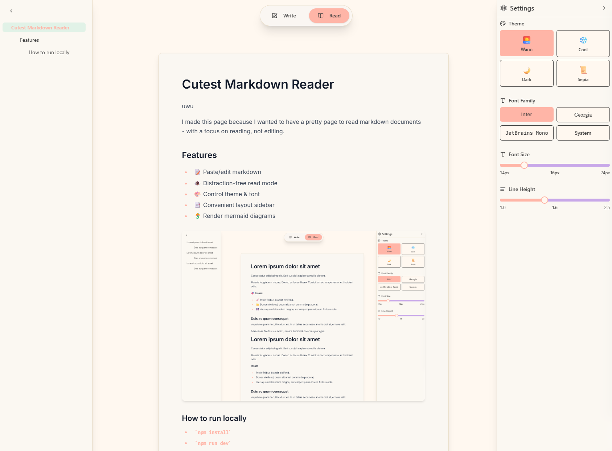

# Cutest Markdown Reader
uwu

I made this page because I wanted to have a pretty page to read markdown documents - with a focus on reading, not editing.

## Features

* 📝 Paste/edit markdown
* 👁️ Distraction-free read mode
* 🎨 Control theme & font
* 📑 Convenient layout sidebar
* 🧜‍♀️ Render mermaid diagrams

### How to run locally
* `npm install`
* `npm run dev`
