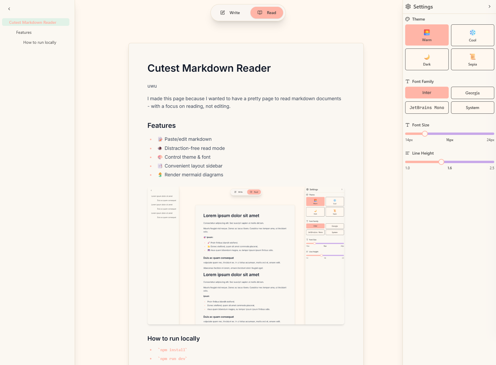

# Cutest Markdown Reader

uwu

I made this page because I wanted to have a pretty page to read markdown documents - with a focus on reading, not editing.

## Features

- 📝 Paste/edit markdown
- 👁️ Distraction-free read mode
- 🎨 Control theme & font
- 📑 Convenient layout sidebar
- 🧜‍♀️ Render mermaid diagrams

### How to run locally

- `pnpm install`
- `pnpm run dev`

### Scripts

- `pnpm run fmt`
- `pnpm run fmt:check`
- `pnpm run lint`

### Credits

- favicon by [Smashicons - Flaticon](https://www.flaticon.com/free-icons/book)
